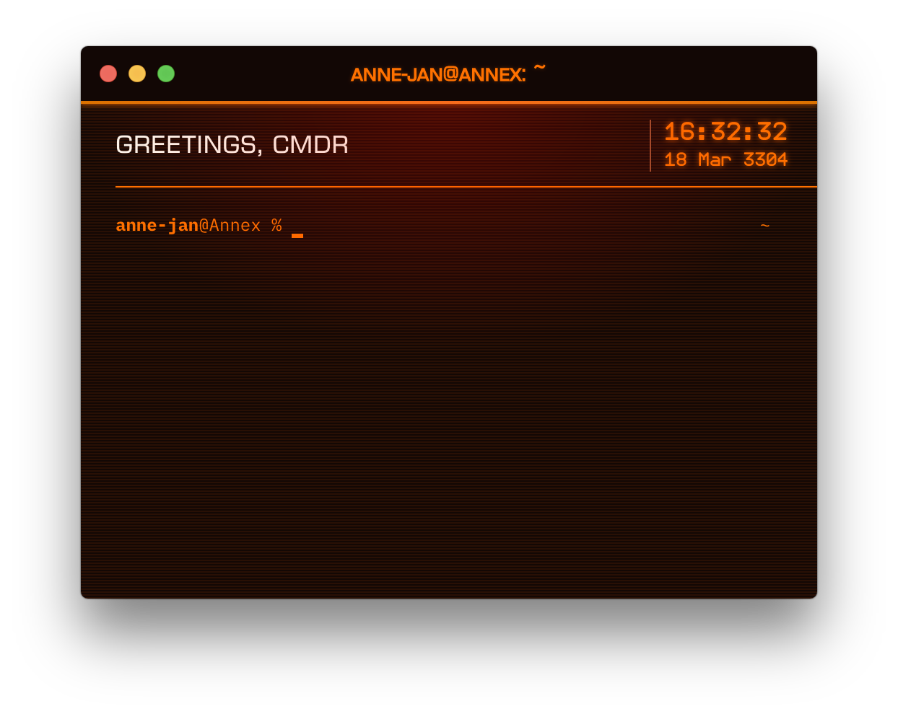

# hyper-elite
Elite Dangerous inspired theme for Hyper.

## Installation

Add `hyper-elite` to your `~/.hyper.js` config file and reload Hyper.

## Tip

To get the same look as in the screenshot, you'll need to install the fonts `EuroCaps` and `Telegrama-Render`. Both are available from [EDAssets.org](http://edassets.org).
